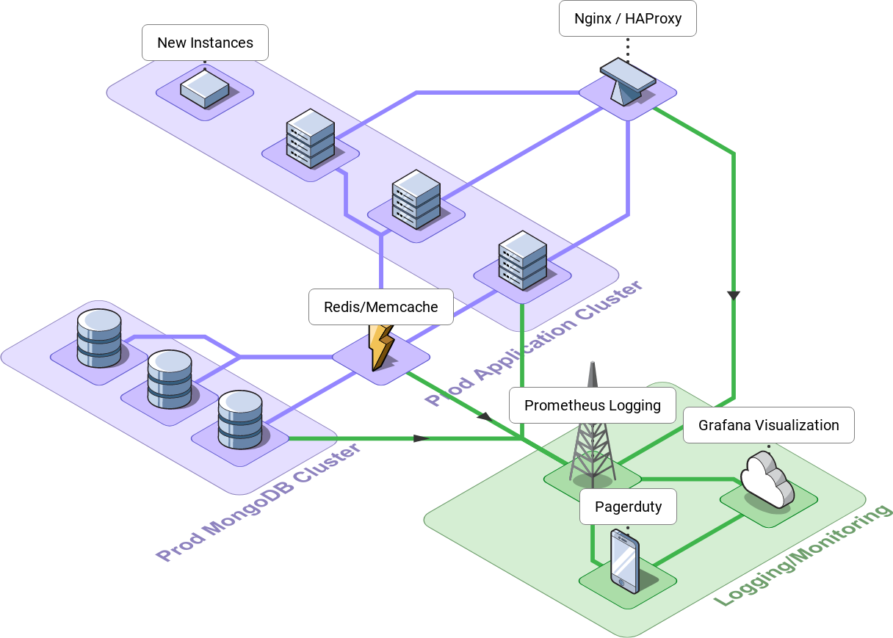

## Table of Contents

- [Table of Contents](#table-of-contents)
- [Initial Challenge](#initial-challenge)
- [Solution](#solution)
  - [Storage](#storage)
  - [Load Balancing](#load-balancing)
  - [Caching](#caching)
  - [Monitoring](#monitoring)
  - [Architecture diagram](#architecture-diagram)
  - [Problems and Bottlenecks](#problems-and-bottlenecks)
  - [Database scalability and consistency](#database-scalability-and-consistency)
  - [Knowledge of technologies shared by the teams](#knowledge-of-technologies-shared-by-the-teams)
  - [Load balancer performance and capacity](#load-balancer-performance-and-capacity)
  - [Server set up for multi-threading or blocking procedures](#server-set-up-for-multi-threading-or-blocking-procedures)
  - [Caching eviction policies and data consistency](#caching-eviction-policies-and-data-consistency)
  - [Handling spikes in traffic or sudden surges in demand](#handling-spikes-in-traffic-or-sudden-surges-in-demand)

## Initial Challenge

You have been tasked with scaling the architecture of a blogging platform to handle millions of requests per second. The platform is currently built using NodeJS and Typescript with some type of database to store the blog posts. The platform has the following endpoints:

- GET /posts - returns all blog posts in the database
- GET /posts/:id - returns the blog post with the specified ID
- POST /assets - creates a new asset with the specified data in the request body
- POST /posts - creates a new blog post with the specified data in the request body
- PUT /posts/:id - updates the blog post with the specified ID with the data in the request body
- DELETE /posts/:id - deletes the blog post with the specified ID

Describe how you would scale the architecture of the blogging platform to handle millions of requests per second. Your answer should cover the following points:

- Data storage: How would you store the blog posts to handle millions of requests per second? What kind of database technology would you use and why?
- Load balancing: How would you distribute incoming requests across multiple server instances to handle millions of requests per second? What kind of load balancing technology would you use and why?
- Caching: How would you optimize the response time of the platform by caching frequently accessed data? What kind of caching technology would you use and why?
- Monitoring and logging: How would you monitor the performance of the platform and identify issues when they arise? What kind of monitoring and logging technology would you use and why?
- Explain what potential problems or bottlenecks in the architecture that you would want to consider in your design
- Provide an architecture diagram of your proposed solution

---

## Solution

### Storage

For storing the blog posts to handle millions of requests per second, we would need a highly scalable and performant database technology. One option is to use a NoSQL database such as MongoDB or Cassandra, which are designed for horizontal scaling and can handle high volumes of read and write operations. Another option is to use a distributed SQL database such as CockroachDB, which can provide the benefits of a SQL database while also being highly scalable.

### Load Balancing

To distribute incoming requests across multiple server instances, we can use a load balancing technology such as NGINX or HAProxy. These technologies can distribute incoming traffic across multiple instances of the application server, helping to evenly distribute the load and prevent any one server from becoming overloaded.

In addition to NGINX or HAProxy, AWS offers load balancing solutions that can help distribute incoming traffic across multiple servers to prevent overloading and ensure high availability. The most used are ELB, ALB, NLB, auto scaling, and AWS Global Accelerator.

- Elastic Load Balancing (ELB): a fully managed load balancing service that automatically distributes incoming application traffic across multiple targets, such as EC2 instances, containers, and IP addresses.
- Application Load Balancer (ALB): a Layer 7 load balancer that can route traffic based on content, such as URL or host header, to different targets, as well as mitigate some common web exploits.
- Network Load Balancer (NLB): a Layer 4 load balancer that can handle millions of requests per second with low latency.
- EC2 Auto Scaling: automatically adjusts the capacity of EC2 instances based on demand.
- AWS Global Accelerator: routes traffic to optimal AWS endpoints based on proximity, network health, and routing policies.

### Caching

To optimize the response time of the platform, we can use a distributed caching technology such as Redis or Memcached to cache frequently accessed data such as blog posts or user information. This can help to reduce the number of requests made to the database and improve overall response time.

### Monitoring

For monitoring and logging, we can use a tool such as Prometheus for monitoring and Grafana for visualization. We can also use a logging tool such as ELK (Elasticsearch, Logstash, Kibana) to collect and analyze logs from the application server and database. These tools can help us to identify and troubleshoot issues with the platform and ensure that it is performing optimally.

### Architecture diagram

### Problems and Bottlenecks

Potential problems or bottlenecks to consider in the design include database scalability and consistency, the level of knowledge of the technologies shared by the teams implementing and maintaining them, load balancer performance and capacity, whether or not the server was set up to use multi-threading or blocking procedures, caching eviction policies and data consistency, and the ability to handle spikes in traffic or sudden surges in demand.

### Database scalability and consistency

To ensure database scalability, consider using sharding or partitioning techniques to distribute the load across multiple databases. You can also use database replication and caching to improve performance. To maintain database consistency, use ACID-compliant transactions and data replication techniques.

### Knowledge of technologies shared by the teams

Encourage cross-functional training and knowledge sharing among team members. Proritize creating documentation and conducting regular knowledge sharing sessions to ensure that all team members are familiar with the technologies used.

### Load balancer performance and capacity

Use load testing tools to identify the performance bottlenecks in the load balancer and optimize its configuration. Consider using a content delivery network (CDN) to distribute the load and improve performance. Use auto-scaling to increase the capacity of the load balancer during spikes in traffic.

### Server set up for multi-threading or blocking procedures

Use non-blocking I/O and asynchronous programming techniques to improve server performance. Consider using a message queue to handle background tasks and reduce server load.

### Caching eviction policies and data consistency

Use a cache eviction policy that balances between data consistency and cache hit rate. Cache invalidation techniques can be used to ensure that the data in the cache is consistent with the data in the database.

### Handling spikes in traffic or sudden surges in demand

Use auto-scaling to increase the capacity of the server during spikes in traffic. A CDN can be used to distribute the load and reduce the load on the server. Use queuing techniques to handle sudden surges in demand and prevent overload.
